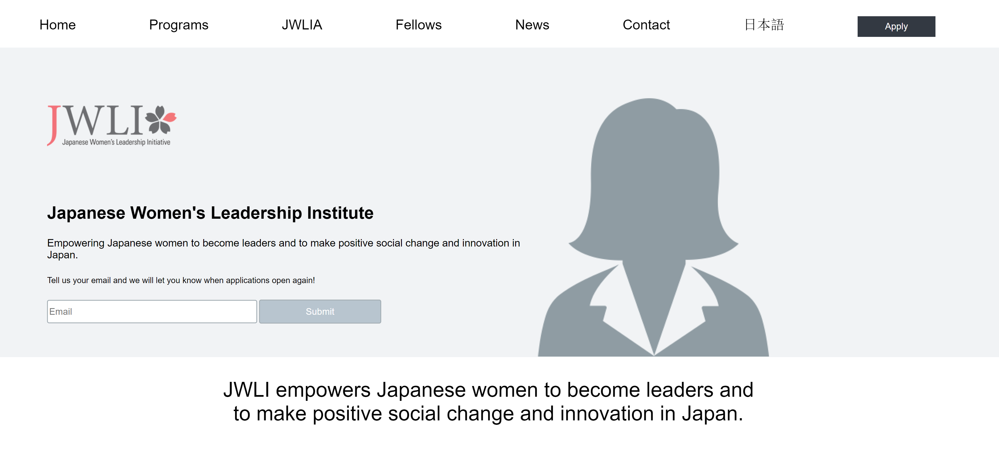

# JWLI Replica

live code: https://kimflores-jwli.netlify.app

# How It's Made:
### Tech used: 
My task was to replicate the JWLI homepage with **HTML** and **CSS**. I was given a screenshot as reference and implemented media queries for responsiveness.

# Lessons Learned:
This site had a lot of content so when coding it was a challenge to visualize what I would decide to leave in when apply responsiveness. However, marking it up helped provide a visual of next steps. So, it was a interesting applying "Mobile First" principle and seeing how the content would lay. It definitely pushed me to apply good code and design.

## Examples:
Take a look at these couple examples that I have in my own portfolio:

BBC: https://github.com/Kim-Flores/BBC

Yelp: https://github.com/Kim-Flores/Yelp

Level Ground: https://github.com/Kim-Flores/Level-ground

Venture Beat: https://github.com/Kim-Flores/Venture-Beat
